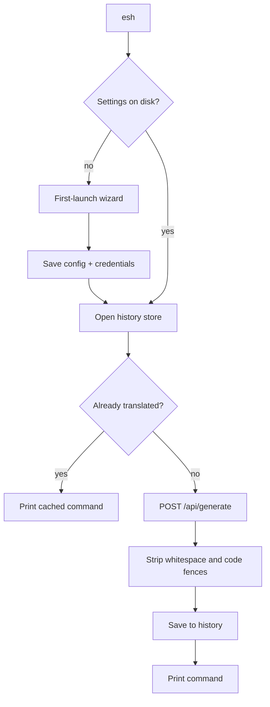

# esh

`esh` translates plain English into shell commands using a large language model served by [Ollama](https://ollama.com). Ask for what you want, get the command back.

```bash
$ esh "list all files in the current directory with their sizes"
ls -la
```

`esh` prints **only** the command to stdout (no explanations, no markdown), so its output composes cleanly with your shell:

```bash
$ $(esh "show the ten largest files under this directory")
$ echo "$(esh "list all files in the current directory with their sizes")"
```

`esh` does **not** execute the command for you — it only translates. You stay in control of what runs.

## Why

- **Local-first.** Works with a local Ollama server out of the box; point it at a remote or hosted endpoint if you prefer.
- **Remembers.** Repeated requests are served from a local history, so the model is not called twice for the same English text.
- **Composable.** Only the command is printed, so it can be piped, substituted, or captured.

## Installation

### From source

Requires [Rust](https://www.rust-lang.org/tools/install) 1.85 or newer (the crate uses the 2024 edition).

```bash
git clone <repository-url> esh
cd esh
cargo install --path .
```

Or build and run without installing:

```bash
cargo build --release
./target/release/esh "list files by size"
```

### Requirements

- A reachable Ollama server. By default `esh` assumes `http://localhost:11434`.
- An API key only if your endpoint requires one (for example a hosted or proxied Ollama server). Local Ollama usually needs none.

## First launch

The first time you run `esh`, it walks you through setup:

```
Welcome to esh! Let's set things up.

Ollama server URL [http://localhost:11434]: 
Ollama API key [None]: 
Available models:
  1. codellama
  2. llama3:latest
Select a model [1]: 2

Settings saved. You're ready to go.
```

1. **Server URL** — press Enter to accept `http://localhost:11434`, or type your endpoint.
2. **API key** — input is hidden. Press Enter for none. If provided, it is sent as `Authorization: Bearer <key>` on every request.
3. **Model** — `esh` lists the models available on your server (sorted). Press Enter to pick the first, or type a number.

If the server can't be reached or reports no models, `esh` shows the error and asks whether to retry. Setup only writes files once it succeeds.

To reconfigure, delete the configuration files (see [Files and locations](#files-and-locations)) and run `esh` again.

## Usage

```
Usage:
  esh <english>          translate English into a shell command
  esh history            list previously translated commands
  esh --clear <english>  remove an entry from the history
  esh --help             show this help
  esh --version          show the version
```

### Translate

```bash
$ esh "find all *.log files modified in the last 24 hours"
find . -name '*.log' -mtime -1
```

Multiple arguments are joined with spaces, so these are equivalent:

```bash
$ esh "list files by size"
$ esh list files by size
```

### Caching and history

Every translation is stored. If you ask for the same English text again (ignoring surrounding whitespace and letter case), the cached command is printed without contacting the model:

```bash
$ esh "list files by size"
ls -laS

$ esh "  LIST files by size  "   # served from history, no LLM call
ls -laS
```

View everything `esh` remembers:

```bash
$ esh history
  1. list all files in the current directory with their sizes
     ls -la
  2. find all *.log files modified in the last 24 hours
     find . -name '*.log' -mtime -1
```

Remove an entry by its English text:

```bash
$ esh --clear "list all files in the current directory with their sizes"
Removed 1 history entry.
```

If nothing matches, `esh` says so on stderr (and exits successfully):

```
esh: no history entry found for 'list all files in the current directory with their sizes'
```

## How it works



- **Model listing** uses `GET /api/tags`.
- **Translation** uses `POST /api/generate` with `stream: false` and a strict prompt that instructs the model to reply with only the command. The response is trimmed and any markdown code fences or backticks are stripped before use.
- **Auth** adds `Authorization: Bearer <key>` when an API key is configured, and omits the header otherwise.
- **History matching** compares trimmed, lowercased English text.

## Files and locations

`esh` honours the XDG base directory conventions.

| Purpose | Default location | Override |
|---|---|---|
| Server URL and model | `~/.config/esh/config.json` | `ESH_CONFIG_HOME`, `XDG_CONFIG_HOME` |
| API key | `~/.config/esh/credentials.json` | `ESH_CONFIG_HOME`, `XDG_CONFIG_HOME` |
| Translation history | `~/.local/share/esh/history.json` | `ESH_DATA_HOME`, `XDG_DATA_HOME` |

On Windows, `%APPDATA%\esh` and `%LOCALAPPDATA%\esh` are used when the corresponding environment variables are present. `HOME`/`USERPROFILE` are the final fallback.

The configuration directory is created with mode `0700` and its files with mode `0600` (Unix), so they are readable only by your user.

<details>
<summary>Example configuration files</summary>

`config.json`:

```json
{
  "server_url": "http://localhost:11434",
  "model": "llama3:latest"
}
```

`credentials.json` (the `api_key` field is omitted when no key is set):

```json
{
  "api_key": "your-api-key"
}
```

</details>

## Security notes

- The API key is stored in a separate `credentials.json` with owner-only permissions (`0600`), and the containing directory is `0700`.
- This is permission-based protection, **not** OS-keychain encryption. On a shared machine, anyone who can read your user's files can read the key. If you need stronger protection, run `esh` without an API key against a local server, or restrict access to your account.
- The API key is sent only to the configured server URL.

## Development

```bash
cargo build            # debug build
cargo build --release  # optimised build
cargo test             # run the test suite
cargo clippy --all-targets
```

The test suite covers configuration round-trips and file permissions, history find/add/replace/remove semantics, prompt construction and output sanitizing, and the Ollama client (model listing, Bearer auth presence/absence, translation, empty responses, and HTTP error handling) against an in-process mock server.

### Project layout

| Path | Contents |
|---|---|
| `src/main.rs` | CLI parsing and command dispatch |
| `src/setup.rs` | Interactive first-launch wizard |
| `src/config.rs` | Settings load/save |
| `src/ollama.rs` | Ollama HTTP client and prompt handling |
| `src/history.rs` | Translation history store |
| `src/fsutil.rs` | Path resolution and private file writes |
| `src/error.rs` | Error type |
| `docs/requirements/` | Requirements documents |

## Troubleshooting

**"could not reach the Ollama server"**
Check that Ollama is running and that the server URL is correct. For a local install, `curl http://localhost:11434/api/tags` should return JSON.

**"the server returned HTTP 401" / `403`**
The endpoint requires an API key. Re-run setup with a valid key (delete the config files first to re-trigger the wizard).

**The model returns a bad or multi-line answer**
`esh` uses a strict prompt and strips code fences, but a small or poorly suited model can still produce extra text. Prefer a capable code-oriented model in setup.

**Setup keeps failing**
Verify the server URL and that at least one model is pulled, e.g. `ollama pull llama3`. You can also set the URL and API key non-interactively by writing the config files described above.

## Limitations and roadmap

- `esh` does not execute translated commands.
- History entries are matched by exact English text (case/whitespace-insensitive); there is no fuzzy matching.
- The API key is protected by file permissions rather than an OS keychain.

## License

Not yet specified.
