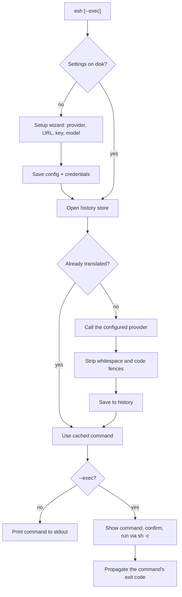

# esh


`esh` translates plain English into shell commands using a large language model. Ask for what you want, get the command back. It works with a local [Ollama](https://ollama.com) server and with hosted providers — OpenAI, Anthropic, Google Gemini, and any OpenAI-compatible service.

```bash
$ esh "list all files in the current directory with their sizes"
ls -la
```

`esh` prints **only** the command to stdout (no explanations, no markdown), so its output composes cleanly with your shell:

```bash
$ $(esh "show the ten largest files under this directory")
$ echo "$(esh "list all files in the current directory with their sizes")"
```

By default `esh` only translates: it prints the command and leaves the decision to run it up to you. Pass `--exec` when you want `esh` to run it — it shows the command and asks for confirmation first.

## Why

- **Provider-agnostic.** Use a local Ollama server, OpenAI, Anthropic, Google Gemini, or any OpenAI-compatible service — and switch with one command.
- **Local-first.** The default provider is a local Ollama server, so nothing leaves your machine unless you choose a hosted provider.
- **Remembers.** Repeated requests are served from a local history, so the model is not called twice for the same English text.
- **Composable.** Only the command is printed, so it can be piped, substituted, or captured.

## Installation

### From source

Requires [Rust](https://www.rust-lang.org/tools/install) 1.85 or newer (the crate uses the 2024 edition).

```bash
git clone <repository-url> esh
cd esh
cargo install --path .
```

Or build and run without installing:

```bash
cargo build --release
./target/release/esh "list files by size"
```

### Requirements

- A reachable LLM provider (see [Providers](#providers)). The default is a local Ollama server at `http://localhost:11434`.
- An API key for hosted providers. Local Ollama and most self-hosted servers need none.
- Network access to the provider's API host, unless you run the model locally.

## Providers

`esh` speaks four wire protocols. Pick a provider during setup, or change it later with [`esh setup`](#switching-providers).

| Provider | `provider` id | Default base URL | API key |
|---|---|---|---|
| Ollama | `ollama` | `http://localhost:11434` | optional |
| OpenAI | `openai` | `https://api.openai.com/v1` | required |
| Anthropic (Claude) | `anthropic` | `https://api.anthropic.com/v1` | required |
| Google Gemini | `gemini` | `https://generativelanguage.googleapis.com/v1beta` | required |
| Groq | `groq` | `https://api.groq.com/openai/v1` | required |
| Mistral | `mistral` | `https://api.mistral.ai/v1` | required |
| DeepSeek | `deepseek` | `https://api.deepseek.com/v1` | required |
| xAI (Grok) | `xai` | `https://api.x.ai/v1` | required |
| OpenRouter | `openrouter` | `https://openrouter.ai/api/v1` | required |
| Together AI | `together` | `https://api.together.xyz/v1` | required |
| Custom (OpenAI-compatible) | `custom` | you supply | optional |

The OpenAI-compatible entries all speak the same protocol, so any service exposing an OpenAI-style API works — LM Studio, llama.cpp's server, vLLM, and others. Choose **Custom** and enter its base URL.

## First launch

The first time you run `esh`, it walks you through setup:

```
Welcome to esh! Let's set things up.

Choose your LLM provider:
  1. Ollama  (local or self-hosted, no API key needed)
  2. OpenAI
  3. Anthropic (Claude)
  ...
Provider [1]: 1
Server URL [http://localhost:11434]: 
API key (optional) [None]: 
Available models:
  1. codellama
  2. llama3:latest
Select a model (number or name) [1]: 2

Settings saved: provider 'ollama', model 'llama3:latest'.
```

1. **Provider** — pick a number, or type a provider id. Enter selects Ollama.
2. **Server URL** — press Enter to accept the provider's default, or type your own (required for `custom`).
3. **API key** — input is hidden. Hosted providers require a key; press Enter for none where the provider allows it.
4. **Model** — `esh` lists the models the provider reports. Press Enter for the first, type a number, or type a model name directly.

If the models cannot be listed (for example the endpoint does not expose a list), `esh` asks you to type a model name. Press Enter with no model to start the wizard over.

Setup only writes files once it has a provider, a URL, and a model.

## Usage

```
Usage:
  esh <english>              translate English into a shell command
  esh --exec <english>       translate, then run the command (asks first)
  esh --exec --yes <english> translate and run without asking
  esh setup                  choose or change the LLM provider and model
  esh shell-init [shell]     print shell integration for bash, zsh, or fish
  esh history                list previously translated commands
  esh --clear <english>      remove an entry from the history
  esh --help                 show this help
  esh --version              show the version
```

### Options

| Flag | Meaning |
|---|---|
| `-x`, `--exec` | Run the translated command instead of only printing it |
| `-y`, `--yes` | Skip the confirmation prompt (requires `--exec`) |
| `-h`, `--help` | Show help |
| `-V`, `--version` | Show the version |

Flags may appear before or after the English text. Use `--` to treat everything after it as English text, so a request may begin with a dash.

### Switching providers

Run the wizard at any time to change the provider, server URL, API key, or model:

```bash
$ esh setup
```

This overwrites the stored configuration and credentials. No files need to be deleted.

### Shell integration

`esh --exec` runs the command in a **child process**. That is fine for ordinary commands, but commands that change your shell's own state — `cd`, `export`, `source`, `alias`, `umask` — only affect that child, so they have no lasting effect:

```bash
$ esh -x -y "goto home"
cd ~
# ...but you are still in the same directory
```

A child process can never change its parent shell's working directory, so this cannot be fixed inside `esh` itself. The fix is a small shell function that evaluates `--exec` commands in your *current* shell. Load it from your shell's startup file:

```bash
# bash (~/.bashrc) or zsh (~/.zshrc)
eval "$(esh shell-init zsh)"    # or: esh shell-init bash
```

```fish
# fish (~/.config/fish/config.fish)
esh shell-init fish | source
```

The snippet calls `esh` by absolute path, so it also works from a development build without installing (run this from the project root, or substitute the full path to your build):

```bash
eval "$("$PWD/target/debug/esh" shell-init zsh)"
```

> **Important:** the integration is a shell **function** named `esh`. It only takes effect when your shell resolves the command `esh` to that function. Launching the binary directly — `cargo run -- …` or `./target/debug/esh …` — bypasses it entirely, and `cd` will not persist. Invoke `esh` itself.

With the integration loaded, `--exec` commands run in the current shell, so builtins take effect as if you had typed them:

```bash
$ esh -x -y "goto home"
cd ~
$ pwd
/Users/you
```

Everything else is unchanged: without `--exec` the command is still only printed, subcommands (`setup`, `history`, `shell-init`) and `--help` pass straight through, and the confirmation prompt still applies unless you pass `-y`.

> Because the integration evaluates commands in your current shell, they can change your environment (and affect it more broadly than a subshell would). Keep the confirmation prompt unless you are sure.

#### Verify it took effect

After loading the snippet, confirm your shell now has the function:

```bash
$ type esh
esh is a shell function from /Users/you/.zshrc
```

If `type esh` prints a **path** (for example `/Users/you/.cargo/bin/esh`), the snippet is not loaded in this shell — reload your startup file (`source ~/.zshrc`) or start a new shell (`exec zsh`).

Now check that a state change actually sticks. Call the function directly — not inside `$(...)` or a pipeline, which would run it in a subshell:

```bash
$ cd /
$ esh -x -y "goto home"
cd ~
$ pwd
/Users/you
```

As a control, the same command through the raw binary leaves you where you started, which confirms the function is what makes it work:

```bash
$ cd /
$ /Users/you/code/esh/target/debug/esh -x -y "goto home"
cd ~
$ pwd
/
```

To try the integration without editing your startup file, load it into the current shell first (use the absolute path to your build, or just `esh` if it is installed):

```bash
$ eval "$(/Users/you/code/esh/target/debug/esh shell-init zsh)"
$ type esh
esh is a shell function
```

### Translate

```bash
$ esh "find all *.log files modified in the last 24 hours"
find . -name '*.log' -mtime -1
```

Multiple arguments are joined with spaces, so these are equivalent:

```bash
$ esh "list files by size"
$ esh list files by size
```

### Run the translated command

Pass `-x`/`--exec` to run the command instead of only printing it. Because a generated command could be destructive, `esh` shows it and asks for confirmation first:

```bash
$ esh --exec "show the current directory in long form"
ls -la
Run this command? [y/N] y
total 24
...
```

Press Enter, or answer anything other than `y`/`yes`, to abort without running anything.

Skip the prompt with `-y`/`--yes` (useful in scripts). `--yes` requires `--exec`:

```bash
$ esh --exec --yes "show the current directory in long form"
```

In exec mode the command and the confirmation prompt are written to **stderr**, so **stdout** carries only the executed command's output. The executed command's exit code becomes `esh`'s exit code, so it composes like any other command:

```bash
$ esh -x -y "run the test suite" && echo "tests passed"
```

The command runs through the system shell (`sh -c` on Unix, `cmd /C` on Windows), so pipes, redirects, and globbing behave as they would if you typed the command yourself.

### Caching and history

Every translation is stored. If you ask for the same English text again (ignoring surrounding whitespace and letter case), the cached command is printed without contacting the model:

```bash
$ esh "list files by size"
ls -laS

$ esh "  LIST files by size  "   # served from history, no LLM call
ls -laS
```

View everything `esh` remembers:

```bash
$ esh history
  1. list all files in the current directory with their sizes
     ls -la
  2. find all *.log files modified in the last 24 hours
     find . -name '*.log' -mtime -1
```

Remove an entry by its English text:

```bash
$ esh --clear "list all files in the current directory with their sizes"
Removed 1 history entry.
```

If nothing matches, `esh` says so on stderr (and exits successfully):

```
esh: no history entry found for 'list all files in the current directory with their sizes'
```

## How it works



- **Model listing** uses the provider's models endpoint (`GET /api/tags` for Ollama, `GET /models` for the others).
- **Translation** uses the provider's generation endpoint (`POST /api/generate` for Ollama, `POST /chat/completions` for OpenAI-compatible services, `POST /messages` for Anthropic, and `POST /models/{model}:generateContent` for Gemini) with a strict prompt that instructs the model to reply with only the command. The response is trimmed and any markdown code fences or backticks are stripped before use.
- **Auth** is provider-specific: `Authorization: Bearer <key>` for Ollama (when set) and OpenAI-compatible services, `x-api-key` plus `anthropic-version` for Anthropic, and `x-goog-api-key` for Gemini.
- **Execution** (with `--exec`) shows the command, optionally confirms, runs it via a child shell, and forwards its exit code. Without `--exec`, nothing is run. Commands that change shell state (`cd`, `export`, ...) need [shell integration](#shell-integration) to affect your current shell.
- **History matching** compares trimmed, lowercased English text.

## Files and locations

`esh` honours the XDG base directory conventions.

| Purpose | Default location | Override |
|---|---|---|
| Provider, server URL, and model | `~/.config/esh/config.json` | `ESH_CONFIG_HOME`, `XDG_CONFIG_HOME` |
| API key | `~/.config/esh/credentials.json` | `ESH_CONFIG_HOME`, `XDG_CONFIG_HOME` |
| Translation history | `~/.local/share/esh/history.json` | `ESH_DATA_HOME`, `XDG_DATA_HOME` |

On Windows, `%APPDATA%\esh` and `%LOCALAPPDATA%\esh` are used when the corresponding environment variables are present. `HOME`/`USERPROFILE` are the final fallback.

The configuration directory is created with mode `0700` and its files with mode `0600` (Unix), so they are readable only by your user.

<details>
<summary>Example configuration files</summary>

`config.json` for OpenAI (a missing `provider` field defaults to `ollama`, so older configs keep working):

```json
{
  "provider": "openai",
  "server_url": "https://api.openai.com/v1",
  "model": "gpt-4o-mini"
}
```

`credentials.json` (the `api_key` field is omitted when no key is set):

```json
{
  "api_key": "your-api-key"
}
```

</details>

## Security notes

- The API key is stored in a separate `credentials.json` with owner-only permissions (`0600`), and the containing directory is `0700`.
- This is permission-based protection, **not** OS-keychain encryption. On a shared machine, anyone who can read your user's files can read the key. If you need stronger protection, use a local provider without an API key, or restrict access to your account.
- The API key is sent only to the configured provider's base URL.

## Development

```bash
cargo build            # debug build
cargo build --release  # optimised build
cargo test             # run the test suite
cargo clippy --all-targets
```

The test suite covers CLI parsing (flags, subcommands, `--`, error cases), command execution and exit-code propagation, configuration round-trips (including provider defaults and validation) and file permissions, history find/add/replace/remove semantics, prompt construction and output sanitizing, and the LLM client for every protocol (model listing, auth headers, translation, empty responses, and HTTP error handling) against an in-process mock server.

### Project layout

| Path | Contents |
|---|---|
| `src/main.rs` | CLI parsing, command dispatch, and command execution |
| `src/interactive.rs` | Prompt and confirmation helpers |
| `src/setup.rs` | Interactive configuration wizard |
| `src/provider.rs` | Supported providers and their wire protocols |
| `src/llm.rs` | Provider-agnostic model listing and translation |
| `src/shellinit.rs` | Shell integration snippets (bash, zsh, fish) |
| `src/config.rs` | Settings load/save |
| `src/history.rs` | Translation history store |
| `src/fsutil.rs` | Path resolution and private file writes |
| `src/error.rs` | Error type |
| `docs/requirements/` | Requirements documents |

## Troubleshooting

**`esh -x "goto home"` prints `cd ~` but doesn't change directory**
`cd` is a shell builtin and `esh` runs commands in a child process, which cannot change your shell's directory (the same is true of `export`, `source`, `alias`, and `umask`). Load the [shell integration](#shell-integration) so `--exec` evaluates commands in the current shell.

**`cd` still doesn't stick after loading the integration**
Make sure you are running `esh` itself, not the binary directly. `cargo run -- -x -y …` and `./target/debug/esh -x -y …` bypass the shell function. If you run from a development checkout, point the integration at your build:

```bash
eval "$("$PWD/target/debug/esh" shell-init zsh)"
type esh    # should say: esh is a shell function
```

**"could not reach the server"**
Check that the provider is running and the server URL is correct. For local Ollama, `curl http://localhost:11434/api/tags` should return JSON.

**"the server returned HTTP 401" / `403`**
The endpoint requires a valid API key. Run `esh setup` and enter a key for the selected provider.

**"Anthropic requires an API key" / "Google Gemini requires an API key"**
These providers cannot be used without a key. Re-run `esh setup` and provide one.

**"unknown provider ... in the configuration"**
The config references a provider id `esh` does not know. Run `esh setup` to pick a valid provider.

**The model returns a bad or multi-line answer**
`esh` uses a strict prompt and strips code fences, but a small or poorly suited model can still produce extra text. Prefer a capable code-oriented model in setup.

**Setup keeps failing**
Verify the server URL and that the provider exposes at least one model. If it cannot list models, type a model name directly when prompted. You can also set things up non-interactively by writing the config files described above.

## Limitations and roadmap

- Execution is opt-in (`--exec`) and never happens in the default, print-only mode.
- `--exec` runs commands in a child shell, so shell-state changes (`cd`, `export`, ...) do not persist unless the [shell integration](#shell-integration) is loaded.
- `esh` does not attempt to judge whether a generated command is safe; with `--exec` it relies on your confirmation, and with `--exec --yes` it runs the command as-is.
- The provider is chosen globally, not per request; switching providers means re-running `esh setup`.
- Model listing shows whatever the provider returns, including non-chat models for some providers.
- History entries are matched by exact English text (case/whitespace-insensitive); there is no fuzzy matching.
- The API key is protected by file permissions rather than an OS keychain.

## License

GPL-V3.0 or later.

## Donate

<https://paypal.me/mindaslab>
